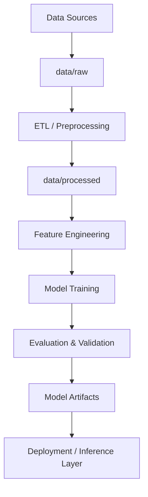

# AI Engineering Production Template & Portfolio Hub


## 📋 Overview

**This repository serves as a production-grade template for scalable Artificial Intelligence and Machine Learning projects.**

In the field of AI Engineering, the gap between a research notebook and a deployable system is often defined by structure, reproducibility, and separation of concerns. This repository implements a standardized architecture designed to bridge that gap, providing a robust foundation for:

*   **NLP & Large Language Models (LLM)** pipelines (RAG, Fine-tuning).
*   **Computer Vision** inference and training workflows.
*   **MLOps** best practices including experiment tracking and modular codebases.

It allows engineers to move away from "spaghetti code" notebooks to maintainable, testable, and scalable AI systems.

---

## 💡 Why This Repository Exists

Most AI projects fail to transition from experimentation to production.

Common issues include:
- Notebook-centric development with hidden state
- Tight coupling between data, models, and evaluation
- No clear path from training to deployment
- Lack of testing, reproducibility, and documentation

This repository was created to **solve those problems at the architectural level**.

It provides a **repeatable, production-oriented blueprint** for building AI systems
that can evolve from research experiments into deployable, maintainable products.

---

## 🏗️ System Architecture (Conceptual)



### 📂 Directory Structure

This template enforces a strict separation between data, source code, and experiments.

```bash
yassinebenacha/
├── 📂 data/             # Data registry (immutable raw data vs processed artifacts)
├── 📂 notebooks/        # Jupyter notebooks for exploration (not for production code)
├── 📂 src/              # The core production codebase
│   ├── 📂 pipeline/     # Data processing & ETL pipelines
│   ├── 📂 models/       # Model definitions (PyTorch/Transformers classes)
│   └── 📂 utils/        # Shared utility functions
├── 📂 models/           # Serialized model weights & checkpoints
├── 📂 tests/            # Automated test suite (Pytest)
├── 📂 scripts/          # Standalone training/inference scripts
└── 📄 README.md         # Documentation & Entry point
```

## 🔥 Core Design Principles

- **Separation of Concerns**
  Data, models, training, and evaluation are strictly decoupled.

- **Reproducibility First**
  Every experiment should be repeatable from raw data to metrics.

- **Scalability by Design**
  Code structure supports growth from local experiments to cloud deployment.

- **Framework Flexibility**
  The template supports NLP, CV, and tabular ML use cases.

- **Production Mindset**
  Everything is designed with deployment, monitoring, and maintenance in mind.

---

## 🔄 AI Project Lifecycle Supported by This Template

This template is designed to support the full AI engineering lifecycle:

1. **Problem Definition**
   - Clear separation between experimentation and production goals

2. **Data Ingestion & Processing**
   - Raw vs processed data separation
   - Reproducible preprocessing pipelines

3. **Experimentation**
   - Rapid prototyping in `notebooks/`
   - Feature exploration and hypothesis testing

4. **Model Engineering**
   - Modular model definitions in `src/`
   - Framework-agnostic design (PyTorch / Transformers)

5. **Training & Evaluation**
   - Script-driven training (not notebook execution)
   - Consistent evaluation logic

6. **Testing & Validation**
   - Unit and integration tests for critical components

7. **Deployment Readiness**
   - Clear path toward API or batch inference systems

## ⚙️ MLOps & Production Readiness

This template is designed to integrate naturally with MLOps tooling, including:

- Experiment tracking (MLflow, Weights & Biases)
- Model versioning and artifact storage
- CI/CD pipelines (GitHub Actions)
- API deployment (FastAPI)
- Monitoring and retraining workflows

While not implemented by default, the structure is intentionally compatible
with enterprise-grade AI pipelines.

---

## 🔮 Future Roadmap

To further elevate this template to a "deploy-anywhere" standard, the following improvements are planned:

- [ ] **Containerization**: Add `Dockerfile` and `docker-compose.yml` for reproducible environments.
- [ ] **CI/CD Integration**: Implement GitHub Actions for automated linting (`ruff`), testing (`pytest`), and building.
- [ ] **Infrastructure as Code**: Add Terraform scripts for cloud resource provisioning (AWS/Azure).
- [ ] **Model Serving**: Integrate TorchServe or Triton Inference Server examples.

---

## 🚀 Getting Started

To use this template for a new AI project:

### 1. Clone & Setup
```bash
git clone https://github.com/yassinebenacha/yassinebenacha.git
cd yassinebenacha
```

### 2. Environment Initialization
It is recommended to use a virtual environment or Conda.
```bash
python -m venv venv
source venv/bin/activate  # On Windows: venv\Scripts\activate
# pip install -r requirements.txt (Populate with your project dependencies)
```

### 3. Workflow
*   **Exploration**: Start in `notebooks/` for EDA (Exploratory Data Analysis).
*   **Engineering**: Move stable logic to `src/`.
*   **Training**: Execute training jobs via `scripts/train.py` (to be created).
*   **Testing**: Validation via `tests/`.

---

## 💡 How This Repository Is Used as a Portfolio

This repository serves as:
- A personal AI engineering standard
- A reusable base for future projects
- A reference for recruiters to understand my engineering approach

Concrete AI projects built on top of this template are linked separately
and reuse this structure to ensure consistency and quality.

---

## 👨‍💻 About the Author

**Yassine Ben Acha** is an AI Engineer and final-year student at **ENIAD**, with a strong focus on Machine Learning, NLP, and production AI systems.

He has worked on industrial AI projects at **Capgemini**, where he contributed to intelligent diagnostic systems using NLP, RAG pipelines, and explainable AI. His interests lie at the intersection of AI research and real-world deployment.

> **🟢 Open for Opportunities**: Yassine is currently seeking a **4-6 month internship** starting **January 2026**.

### 🧠 Expertise
*   **AI & Machine Learning**: PyTorch, TensorFlow, Scikit-learn, XGBoost.
*   **NLP & LLMs**: Hugging Face Transformers, RAG Pipelines, LangChain, Gemini API.
*   **MLOps & Engineering**: Docker, FastAPI, Streamlit, Git/CI-CD.
*   **Visualization**: Streamlit, Plotly, Matplotlib.

### 💼 Key Experience
*   **Capgemini**: Engineered an Intelligent Engine Fault Diagnosis System using NLP and RAG. Implemented Generative AI interfaces and focused on model explainability (SHAP).
*   **Prodigy Info Tech**: Developed ML pipelines for regression and clustering tasks.
*   **Academic**: Facial Recognition systems and Educational AI platforms.

### 🌐 Connect
*   [LinkedIn](https://www.linkedin.com/in/yassine-ben-acha-64332b248/)
*   [GitHub](https://github.com/yassinebenacha)
*   [Portfolio](https://portfolio-pro-phi.vercel.app/)

---

## 📄 License

This project is open-source and available under the **MIT License**.
